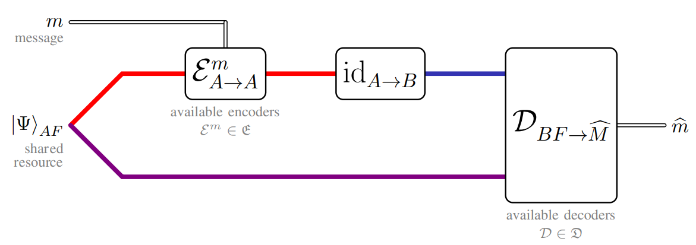

## Brief Summary

Dense coding is one of the earliest and most prominent quantum protocols that reveal the power of quantum entanglement in communication. Although it has been intensively studied, it has typically been restricted to scenarios where the receiver can perform global measurements to decode information, which is experimentally challenging. Thus, it is natural to impose locality conditions on the decoders from a practical perspective.

In this work, we explore the practicality of dense coding by elaborating 21 classes of dense coding capacities with different encoder-decoder pairs, where the encoders are constrained by the resource theory of asymmetry and the decoders are constrained by various locality conditions. Our contributions are to 1) show that all these capacities are equal and derive a single-letter capacity formula; 2) prove that all these capacities satisfy the desirable strong converse property; and 3) establish an equivalence among three different quantities of a bipartite quantum state—the operationally defined dense coding capacity, the mathematically defined regularized asymmetry of assistance, and the quantum entropy of the twirled quantum state—thus providing the regularized asymmetry of the assistance measure an operational meaning.

Our results significantly push forward the research of practical dense coding in both the one-shot and asymptotic regimes within different resource theories. These results deepen our understanding of quantum entanglement and dense coding, and, more generally, the classical and quantum communication via quantum resources.