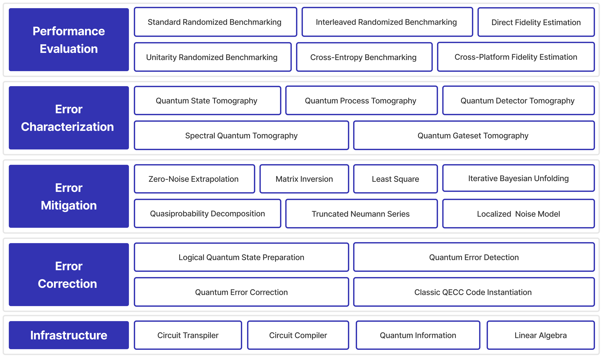



### Brief Introduction

I led the development of
**the open-source [Quantum Error Processing (QEP)](https://pypi.org/project/qcompute-qep/) toolkit**. 
My proficiency in quantum computing has enabled me to identify critical needs and 
select the most suitable quantum solutions. 
Simultaneously, my expertise in computer science has empowered me to 
design robust and efficient data structures, algorithms, and software architectures, 
and uphold a well-structured software development life cycle, 
ensuring the timely delivery of these solutions with high quality.

QEP stands at the forefront as an innovative and pioneering open-source quantum error processing toolkit, 
representing a core component seamlessly integrated into the 
[Baidu Quantum Platform](https://baike.baidu.com/item/%E7%99%BE%E5%BA%A6%E9%87%8F%E5%AD%90%E5%B9%B3%E5%8F%B0),
which is a full-stack quantum software and hardware platform developed by Baidu.
This toolkit serves a paramount purpose in characterizing and enhancing the performance of quantum computers 
by effectively addressing and mitigating the inherent quantum errors presented in these devices through 
sophisticated software solutions. 

### Functions

QEP boasts a comprehensive suite of four powerful quantum error processing tools: 

+ **Quantum Performance Evaluation**, for assessing the capabilities and extendibilities of quantum computing hardware platforms, through estimating the error rates of quantum states, quantum gates, and quantum measurement apparatus. It provides standard randomized benchmarking, interleaved randomized benchmarking, cross-entropy benchmarking, unitarity randomized benchmarking, direct fidelity estimation, and cross-platform fidelity estimation methods.

+ **Quantum Error Characterization**, for reconstructing the comprehensive information in quantum computing hardware platforms, through many partial and limited experimental results. It provides quantum state tomography, quantum process tomography, quantum detector tomography, quantum gateset tomography, and spectral quantum tomography.

+ **Quantum Error Mitigation**, used for improving the accuracy of quantum computational results, through post-processing the experiment data obtained by varying noisy experiments,
extending the computational reach of a noisy superconducting quantum processor. It provides zero-noise extrapolation technique to mitigate quantum gate noise, and a collection of methods such as inverse, least-square, iterative Bayesian unfolding, Neumann series to mitigate quantum measurement noise.

+ **Quantum Error Correction**, used to protect quantum information from errors due to environmental noise and imperfections in hardware. Quantum computers rely on the delicate properties of quantum systems, which are susceptible to errors, and thus, QEC has become an essential tool for realizing fault-tolerant quantum computing. It provides a simulator that can simulate error correction codes based on the stabilizer formalism, allowing users to study the effects of various types of noise, assess the performance of different error correction codes, and evaluate the robustness of quantum algorithms to errors.

The versatile capabilities embedded in QEP empower our quantum hardware team to engage in a meticulous 
and rigorous process of characterizing and enhancing Baidu's quantum processors. By leveraging QEP's advanced tools, 
we can delve into the intricate details of quantum performance, understand the characteristics of errors, 
implement effective mitigation strategies, and deploy quantum error correction codes. 
This comprehensive approach accelerates closed-loop and end-to-end optimizations, 
thus playing an instrumental role in advancing the capabilities, robustness, and reliability of 
our quantum computing infrastructure. The technology landscape of QEP is as follows. 

### Metrics

QEP is officially released at ["Quantum Create 2022"](https://baike.baidu.com/item/%E9%87%8F%E5%AD%90%E5%BC%80%E5%8F%91%E8%80%85%E5%A4%A7%E4%BC%9A),
a grand quantum developer conference held in Beijing.
The release garnered widespread recognition from mainstream news media, including 
[AnalyticDrift](https://analyticsdrift.com/baidu-unveils-its-first-superconducting-quantum-computer-qianshi/),
[PingWest](https://en.pingwest.com/a/10696),
[Toutiao](https://www.toutiao.com/article/7137927453540237838),
[QbitAI](https://mp.weixin.qq.com/s/6jfh_MMypbqHq3KlhYiTew), and many others.
Establishing a robust foundation backed by **5** research papers and over **50** patent applications, 
the latest version, [QEP 1.1.0](https://pypi.org/project/qcompute-qep/), 
brings unparalleled versatility to quantum hardware access. 
This release significantly expands its support to diverse platforms from five leading companies, 
further solidifying its position at the forefront of quantum error processing toolkits.
QEP's modular design, founded on the software design philosophy 
of "high cohesion, loose coupling" for effective code organization and 
independent functionalities, features **32** core modules. With a vast repository housing **26,000**
lines of open-source code, and an extensive library of **37** bilingual tutorials, 
alongside comprehensive API documentation, QEP is designed to be user-friendly, allowing easy access and utilization of its capabilities.

For more detailed information about QEP, interested parties can 
explore the repository on [GitHub](https://github.com/baidu/QCompute/tree/master/Extensions/QuantumErrorProcessing)
or access the package on [PyPI](https://pypi.org/project/qcompute-qep/). 
These platforms offer in-depth insights into QEP's features, functionalities, implementation guidelines, and user tutorials.

### Team Contribution

The success of QEP is indebted to the invaluable contributions of numerous research interns and engineers. 
Through effective management and the implementation of a rotation mechanism, 
I established a system that facilitated the swift integration of research interns into the project, 
enabling them to make meaningful contributions. To date, **12** research interns have seamlessly 
immersed themselves in the realm of quantum computing, 
acquiring expertise in both theoretical and practical aspects of quantum error processing.
Their talents have played a pivotal role in driving innovative projects that push the boundaries of quantum technology. 
The sustained fascination these interns exhibit toward quantum computing stands as a testament to the passion and 
enthusiasm that I have ignited in these future researchers. 
This collaborative effort underscores the collaborative and dynamic nature of the quantum research environment 
that has been cultivated within the QEP project.
